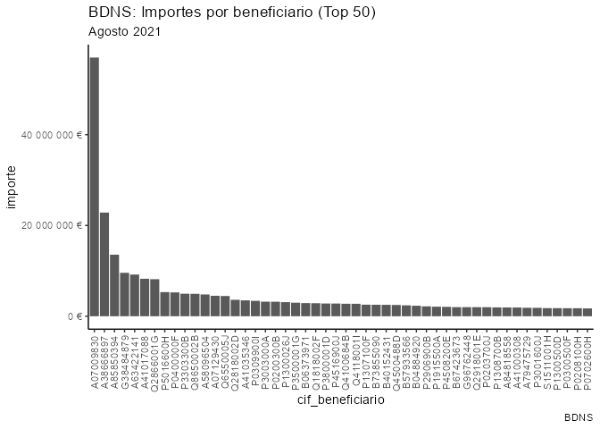

<!-- README.md is generated from README.Rmd. Please edit that file -->

# subvencionesES

<!-- badges: start -->

[](https://github.com/dadosdelaplace/Rsubvenciones_spain/actions/workflows/check-pak.yaml)
[](https://www.gnu.org/licenses/gpl-3.0)
[](https://github.com/dadosdelaplace/Rsubvenciones_spain/graphs/contributors)
[](https://discord.com/invite/r2ytSa782D)

<!-- badges: end -->

Aportación desde la **comunidad de R** para la extracción, limpieza y
visualización de los datos del volcado de la Base de Datos Nacional de
Subvenciones (BDNS). Github del proyecto global y comunitario puesto en
marcha por [**Jaime
Gómez-Obregón**](https://github.com/JaimeObregon/subvenciones).

|              |                                                                      |
|--------------|----------------------------------------------------------------------|
| GitHub       | <https://github.com/JaimeObregon/subvenciones>                       |
| Discord      | <https://discord.com/invite/r2ytSa782D>                              |
| Idea inicial | <https://twitter.com/JaimeObregon/status/1507693311422877697> (hilo) |

## Instalación

Puedes instalar el paquete desde [GitHub](https://github.com/) con:

``` r
# install.packages("devtools")
devtools::install_github("dadosdelaplace/Rsubvenciones_spain",
                         ref = "rpak")
```

## Ejemplo

Carga convocatorias:

``` r
library(subvencionesES)

convocatorias <- carga_convocatorias()

convocatorias
#> # A tibble: 350,078 x 13
#>    IDConv id     mrr   convocanteN1  convocanteN2 convocanteN3 fechareg   titulo
#>    <chr>  <chr>  <lgl> <chr>         <chr>        <chr>        <date>     <chr> 
#>  1 819060 617500 FALSE DIPUTACIÓN P~ DIPUTACIÓN ~ <NA>         2022-03-25 ADQUI~
#>  2 819059 617499 FALSE REGIÓN DE MU~ INSTITUTO M~ <NA>         2022-03-25 MANCO~
#>  3 819058 617498 FALSE ONDA          AYUNTAMIENT~ <NA>         2022-03-25 Conve~
#>  4 819057 617497 FALSE TORRENT       AYUNTAMIENT~ <NA>         2022-03-25 SUBVE~
#>  5 819056 617496 FALSE REGIÓN DE MU~ INSTITUTO M~ <NA>         2022-03-25 AYUNT~
#>  6 819055 617495 FALSE ONDA          AYUNTAMIENT~ <NA>         2022-03-25 Conve~
#>  7 819054 617494 FALSE TORRENT       AYUNTAMIENT~ <NA>         2022-03-25 ASIGN~
#>  8 819052 617492 FALSE REGIÓN DE MU~ INSTITUTO M~ <NA>         2022-03-25 AYUNT~
#>  9 819051 617491 FALSE ONDA          AYUNTAMIENT~ <NA>         2022-03-25 Conve~
#> 10 819050 617490 FALSE ARAGÓN        INSTITUTO A~ <NA>         2022-03-25 CONVE~
#> # ... with 350,068 more rows, and 5 more variables: bbreguladoras <chr>,
#> #   tituloleng <chr>, verConcesiones <lgl>, dummy1 <dbl>, dummy2 <dbl>
```

Carga subvenciones (archivos jurídicas):

``` r
subvenciones <- carga_subvenciones()

subvenciones
#> # A tibble: 3,810,368 x 17
#>    ID       IDConv convocanteN1           convocanteN2 convocanteN3 convocatoria
#>    <chr>    <chr>  <chr>                  <chr>        <chr>        <chr>       
#>  1 65045185 811910 COMARCA COMUNIDAD DE ~ COMARCA DE ~ <NA>         CONVOCATORI~
#>  2 65045222 811910 COMARCA COMUNIDAD DE ~ COMARCA DE ~ <NA>         CONVOCATORI~
#>  3 65045266 811910 COMARCA COMUNIDAD DE ~ COMARCA DE ~ <NA>         CONVOCATORI~
#>  4 65045280 811910 COMARCA COMUNIDAD DE ~ COMARCA DE ~ <NA>         CONVOCATORI~
#>  5 65042893 818661 DIPUTACIÓN PROV. DE B~ DIPUTACIÓN ~ <NA>         CONVOCATORI~
#>  6 65042591 818652 DIPUTACIÓN PROV. DE B~ DIPUTACIÓN ~ <NA>         CONVOCATORI~
#>  7 65043828 749877 BURJASSOT              AYUNTAMIENT~ <NA>         CONCESIÓN Y~
#>  8 65044522 798146 BURJASSOT              AYUNTAMIENT~ <NA>         APROBACIÓN ~
#>  9 65053424 794733 LA RIOJA               CONSEJERÍA ~ <NA>         Ayudas proy~
#> 10 65053427 794733 LA RIOJA               CONSEJERÍA ~ <NA>         Ayudas proy~
#> # ... with 3,810,358 more rows, and 11 more variables: bbreguladoras <chr>,
#> #   programa <chr>, fechaconc <date>, beneficiario <chr>, importe <dbl>,
#> #   instrumento <chr>, ayudaequiv <dbl>, detalles <dbl>, proyecto <chr>,
#> #   sancion <dbl>, numcov <dbl>
```

Extrae el CIF a partir del texto del campo del beneficiario:

``` r
library(dplyr)


# Subvenciones en Agosto 2021
subvenciones_dic18 <- subvenciones %>%
  filter(fechaconc >= "2021-08-01" & fechaconc <= "2021-08-31") %>%
  extrae_cif() %>%
  select(cif_beneficiario, importe)

resumen_top50 <- subvenciones_dic18 %>%
  group_by(cif_beneficiario) %>%
  summarise(importe = sum(importe)) %>%
  arrange(desc(importe)) %>%
  slice(1:50) %>%
  mutate(cif_beneficiario = factor(cif_beneficiario, levels = cif_beneficiario))


library(ggplot2)

ggplot(resumen_top50, aes(x = cif_beneficiario)) +
  geom_col(aes(y = importe)) +
  scale_y_continuous(labels = scales::number_format(suffix = " €")) +
  theme_classic() +
  theme(axis.text.x = element_text(angle = 90, hjust = 1, vjust = 0.5)) +
  labs(
    title = "BDNS: Importes por beneficiario (Top 50)",
    subtitle = "Agosto 2021",
    caption = "BDNS"
  )
```


